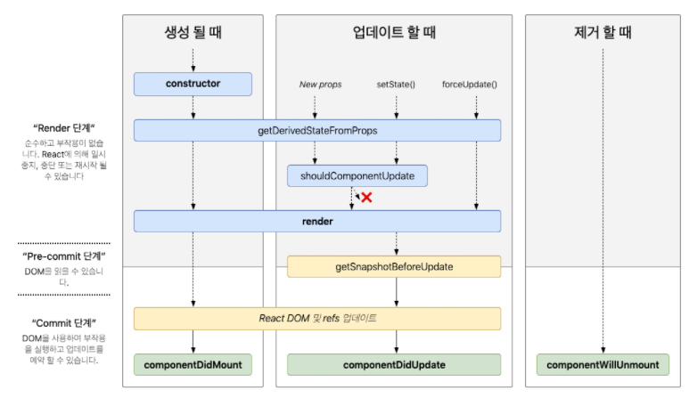

### react_introduce


#### 1) 리액트는 어쩌다 만들어졌을까?

##### 배경

- dom을 직접 건드리는 작업은 번거롭다.

##### React의 발상

- dom을 전부 날려버리고 다시 만들어서 보여주자

##### 문제점

- 매번 이렇게 하게되면 다양한 문제가 발생

##### 해결

- 메모리게 가상DOM을 만든다.
- 업데이트가 필요한 부분만 가상DOM으로 수정한다.
- 그 이후 REACT의 알고리즘을 통해 다른 부분을 감지하여 실제 DOM에 패치 시켜준다.

------

#### 2) 윈도우에서 terminal 설정하는법

1. 상단 file탭
2. Preferences
3. Setting 클릭
   --- 현재까지가 vscode에서 ctrl + , 누른 창
4. Terminal 검색
5. Terminal › External: Windows Exec에 gitbash 경로 삽입

------

#### 3) JSX란?

리액트 컴포넌트에서 xml 형식의 값을 반환해는 것

------

#### 4-1) Babel이란?

- 자바스크립트 문법 확장해주는 도구
- 아직 지원하지 않는 최신 문법을 정식 자바스크립트로 변환해준다.

#### 4-2) JSX 규칙

태그는 꼭 닫혀야 한다.

두개 이상의 태그가 존재한다면 꼭 하나의 태그로 감싸져야 한다.

#### 4-3) Fragment란?

- 단순히 감싸기 용으로 태그를 이용해야 할 때 사용하면된다.
- 형태 : <> </>

#### 4-4) Javascript 값 사용할 때에는 {}를 사용한다.

#### 4-5) 인라인스타일의 경우 style의 네이밍은 camelCase로 사용해야한다.

#### 4-6) css파일에서 불어올때는 'className=' 으로 설정해야한다.

------

#### 5) Props

##### 사용법

- 컴포넌트 내부에서 코드를 작성한다.

```
<Hello name="아무거나">
```

- 받는쪽은 props 라는 예약어를 통해 받는다.

```
function Hello(props) {
  return <div>{props.name}</div>
}
```

##### 비구조화할당

- 컴포넌트의 파라미터에서 {}안에 받는 내용을 미리 표기한다.

```
function Hello({name}) {
  return <div>{name}</div>
}
```

##### defaultProps

```
function Hello({name, age}) {
  return <div>{name}</div>
}

Hello.defaultProps = {
  name: '이름없음'
}
```

##### Props.children

- 컴포넌트 태그 사이에 값이 있을때 'children'이란 예약어를 사용한다.

------

#### 6-1) javascript에서는 null,false,undefined를 렌더링 하면 아무것도 나타나지 않는다.

#### 6-2) 삼항연산자를 이용해 조건부 렌더링을 할 수 있다.

```
    <div style={{ color }}>
      { isSpecial ? <b>*</b> : null }
      안녕하세요 {name}
    </div>
```

#### 6-3) &&를 사용하자

```
    <div style={{ color }}>
      {isSpecial && <b>*</b>}
      안녕하세요 {name}
    </div>
```

- &&를 사용하면 첫번째로 나오는 false값을 반환하며 없다면 마지막 값을 반환한다.

------

#### 7) useState

##### 화살표함수

- 형태

```
const funcName () => {
//body
}
```

##### 리액트에서 이벤트 설정을 주로 "on이벤트이름={함수이름}" 형태로 작성한다.

##### state 선언 방식

```
  const [number, setNumber] = useState(0);
return(
<div>{number}</div>
)
```

##### useState 동작 원리

- 배열 비구조화 할당을 활용
- 첫번째 원소는 현재 상태, 두번째 원소는 setter 함수
- 원래대로라면

```
const numberState = useState(0);
const number = numberState[0];
const setNumber = numberState[1];
```

------

#### 8) Input

- input의 onChange를 사용하면 이벤트 객체 e를 파라미터로 받아올 수 있다.
- 이 객체의 e.target은 이벤트가 발생한 DOM을 가리킨다.
- e.target.value를 조회하면 현재 input의 value값을 알 수 있다.

------

#### 9-1) onChange

- 변할때마다 실행된다.
- 주로 input 태그의 이벤트값을 받아와서 name과 value를 비구조화 할당을 통해 추출한다.

#### 9-2) onClick

- 클릭되면 실행된다.

#### 9-3) 헷갈리는 부분 정리

- 비구조화 할당 : 객체를 추출하는 방법
- 구조분해 할당 : 객체나 배열을 변수로 '분해’할 수 있게 해주는 특별한 문법

------

#### 10) useRef

- javascript에서 특정 Dom을 선택하는 역할 ex) getElementById, querySelector
- 특정 DOM에 접근할 때 사용한다.
- 외부 라ㅣ브러리 사용할때 유용하다.
- 원하는 위치에 ref={} 의 형태로 작성하면 된다.
- 포커스를 잡으려면 nameInput.current.focus() 형태로 작성하면 된다.

```
const nameInput = useReft();

const onClick = () => {
    nameInput.current.focus();
}

return(
    <input ref={nameInput} />
    <button onClick={onClick}>클릭</button>
)
```

------

#### 11-1) Map을 이용한 렌더링

- arr.map(i => ) 의 형태로 하위 컴포넌트에게 값을 전달해준다.

#### 11-2) Map에서 Key가 필요한 이유

- Map에 key 값이없다면 중간의 값이 바뀌었을때 그 하위 값들이 전부 변하기 때문인다. key값을 사용한다면 key를 이용해 중간의 값을 추가하게 된다.

------

#### 12) useRef의 또 다른 역할

- 컴포넌트 안에서 조회 및 수정 할 수 있는 변수 관리
- useRef로 관리되는 변수는 값이 바뀌어도 컴포넌트가 리렌더링 되지 않습니다.

------

#### 13) 배열에 항목 추가

##### spread 연산자 사용

- setUsers([...users, user]);

##### concat 함수 사용

- setUsers(users.concat(user));

##### 1-13 구조에서 알아두면 좋은 점

- 부모 컴포넌트에서 state값(input 등등)과 함수를 작성하고 자식 컴포넌트에게 전달하는 구조를 기억하자

------

#### 14-1) 배열에서 요소 지우기

- filter를 사용하여 false 인 값만 담는다.
- 태그에서 변수를 전달하고 싶을땐 아래와 같이 작성한다.

```
<button onClick={() => onRemove(param)}>
```

#### 14-2) 복습

- input에서 onCick의 event 객체의 경우 위와 같이 변수로 전달해줄 필요 없다. (class형에서는 어떻게 동작할지 알아봐야한다.)

------

#### 15) boolean 값으로 배열 항목 수정하기

- 수정할 때 불변성을 지켜준다.
  - 불변성을 지킨다는건 state값을 유지 한다고 생각하면 된다.
- 수정할때에도 map과 if문을 비교하여 setState를 활용한다.
- style 속성에도 js를 사용할 수 있다.
- boolean 값으로 on/off 할 때 onToggle 이란 함수명을 자주 사용하자

------

#### 16) useEffect

##### 용어

- 마운트 : 처음 나타남
- 언마운트 : 사라짐

##### useEffect 구조

- 함수이다
- 첫번째 인자는 함수, 두번째 인자는 배열(주로 deps 라고 칭한다.)이 들어간다.

##### cleanup 함수

- useEffect 안에서 return 할 때 실행된다.
- useEffcet의 뒷정리를 한다. -> state에서 값 지울때 실행됨

##### deps

- deps 에 특정값을 넣게 되면, 컴퍼넌트가 마운트 될 때, 지정한 값이 업데이트 될 때 useEffect 실행된다.
- deps에 값이 없다면 useEffect가 최신 값을 가리키지 않게 된다.
- deps에 값이 없다면 컴포넌트가 리렌더링 될 때마다 호출이 된다.
- deps에 값을 넣는것을 기본이라고 생각하는게 좋다.

------

#### 17) useMemo

- 성능을 최적화할 때 사용한다.
- memo는 memorized의 약자이다.
- 첫번째 인수에는 함수, 두번째 인수에는 배열을 넣어주면 된다.
  - 두번째 인수에 넣어준 배열의 값이 바뀔때만 함수가 실행된다.
  - 그렇지 않다면 이전의 값을 재사용한다.

------

#### 18) useCallback

- useMemo와 비슷하다. --> useMemo 기반으로 만들어졌기 때문에
- 첫번째 인수에 함수를 두번째 인수에 상태가 props에서 사용하는 배열을 넣는다.

------

#### 19) React.memo를 통한 최적화

- React.memo()안에 컴포넌트(여기서는 함수)를 인자로 넣는다.
- 최적화가 필요한 상황이 아니라면 useCallback을 통한 최적화는 고려해보자
  - 최적화는 학습을 좀 더 하고 사용하면 좋을것같다.

------

#### 20) useReducer

- 현재 컴포넌트가 아닌 다른 곳에 state를 저장하고 싶을때 유용한다.

##### useReducer를 위한 함수

- reducer 라는 함수를 만들고 state와 action 이라는 인자를 받는다.
  - reducer 라는 함수는 예약어는 아니어서 다른 이름으로 만들수있다. (하지만 reducer로 사용하는게 좋다.)
- action에는 객체가 전달되는데 그 안에 type 이라는 프로퍼티를 주로 설정해서 사용한다.
- type 프로퍼티를 통해 switch 문으로 분기한다.
- state는 useReducer를 통해 저장된 변수다.
- 주로 initialState라는 객체에 초기 정보를 담고 useReducer 에게 전달한다.

##### useReducer 형태

```
  const [state, dispatch] = useReducer(reducer, initialState);
```

- reducer는 함수
- initialState는 객체이다

------

#### 21) 커스텀 Hooks

- 반복되는 코드가 있을때 사용하면 좋다.

------

#### 22) Context API : 프로젝트 안에서 전역적으로 사용 할 수 있는 값을 관리

- const UserDispatch = React.createContext(null);
- <UserDispatch.Provider value={dispatch}>...</UserDispatch.Provider>
- Context 안에 Provider 컴포넌트를 통하여 Context 의 값을 정함(& value값 설정)
- Provider 에 의하여 감싸진 컴포넌트 중 어디서든지 Context 의 값을 바로 조회

useReducer의 dispatch 를 Context API 를 사용해서 전역 사용
컴포넌트에게 함수를 전달해줘야 하는 상황에서 코드의 구조가 훨씬 깔끔해짐

------

#### 23) Immer

- $ yarn add immer

- import produce from 'immer';

`produce` 함수를 사용 할 때에는 첫번째 파라미터에는 수정하고 싶은 상태, 두번째 파라미터에는 어떻게 업데이트하고 싶을지 정의하는 함수를 넣어줍니다.

두번째 파라미터에 넣는 함수에서는 불변성에 대해서 신경쓰지 않고 그냥 업데이트 해주면 다 알아서 해줍니다.

------

#### 24) 클래스형 컴포넌트

클래스형 컴포넌트에서는 `render()` 메서드가 꼭 있어야 합니다. 이 메서드에서 렌더링하고 싶은 JSX 를 반환하시면 됩니다. 그리고, `props` 를 조회 해야 할 때에는 `this.props` 를 조회하시면 됩니다.

`defaultProps` 를 설정하는 것은 이전 함수형 컴포넌트에서 했을 때와 똑같이 해주셔도 되고, 다음과 같이 클래스 내부에 `static` 키워드와 함께 선언 할 수도 있습니다.

클래스형 컴포넌트에서는 조금 다릅니다. render 함수 내부에서 선언은 할 수 있기는 있지만, 일반적으로 그렇게 하지는 않고 클래스 안에 커스텀 메서드를 선언합니다.

추후 상태를 업데이트 할 때에는 이 메서드에서 `this.setState` 라는 함수를 사용해야 하는데요, 여기서 `this` 는 컴포넌트 인스턴스를 가르켜야 하는데, 현재 구현한 ex) `handleIncrease` 와 `handleDecrease`에서는 `this` 를 조회하려고 하면 컴포넌트 인스턴스를 가르키지 않게 됩니다.

이렇게 되는 이유는, 우리가 만든 메서드들을 각 button 들의 이벤트로 등록하게 되는 과정에서 각 메서드와 컴포넌트 인스턴스의 관계가 끊겨버리기 때문입니다.

이를 해결하기 위해서 할 수 있는 방법은 총 3가지 방법이 있습니다.

- 첫번째는 클래스의 생성자 메서드 `constructor` 에서 `bind` 작업을 해주는 것 입니다.

  - 함수의 `bind` 를 사용하면, 해당 함수에서 가르킬 `this` 를 직접 설정해줄 수 있습니다. `constructor` 에서는 `props` 파라미터로 받아오고 `super(props)` 를 호출해주어야 하는데, 이는 이 클래스가 컴포넌트로서 작동 할 수 있도록 해주는 Component 쪽에 구현되어있는 생성자 함수를 먼저 실행해주고, 우리가 할 작업을 하겠다 라는 것을 의미합니다.

    이 방법이 가장 일반적인 방법이고, 또 다른 방법은 커스텀 메서드를 선언 할 때 화살표 함수 문법을 사용해서 작성하는 것 입니다.

- 클래스형 컴포넌트에서 화살표 함수를 사용해서 메서드를 구현 하는 것은 클래스에 특정 속성을 선언 할 수 있게 해주는 class-properties라는 문법을 사용

  - 이 문법은 아직 정식 자바스크립트 문법이 아닙니다. 단, CRA 로 만든 프로젝트에는 적용이 되어있는 문법이기 때문에 바로 사용 할 수 있습니다.

- `onClick` 에서 새로운 함수를 만들어서 전달을 하는 것인데 이렇게 사용하는 것을 권장하지 않습니다. 렌더링 할 때마다 함수가 새로 만들어지기 때문에 나중에 컴포넌트 최적화 할 때 까다롭습니다.

##### 상태 선언하기

클래스형 컴포넌트에서 상태를 관리 할 때에는 `state` 라는 것을 사용합니다. `state` 를 선언 할 때에는 `constructor` 내부에서 `this.state` 를 설정해주시면 됩니다.

클래스형 컴포넌트의 `state` 는 무조건 객체형태여야 합니다.

`render` 메서드에서 `state` 를 조회하려면 `this.state` 를 조회하시면 됩니다.

우리가 화살표 함수 문법을 사용하여 메서드를 작성 할 수 있게 해줬던 class-properties 문법이 적용되어 있다면 굳이 `constructor` 를 작성하지 않고도 다음과 같이 `state` 를 설정해줄 수 있습니다.

##### 상태 업데이트 하기

상태를 업데이트해야 할 때에는 `this.setState` 함수를 사용하면 됩니다.

`this.setState` 를 사용 할 떄는 위 코드 처럼 객체 안에 업데이트 하고 싶은 값을 넣어서 호출해주면 되는데요, 만약에 state에 다른 값이 들어있다면` this.setState` 를 할 때 파라미터에 넣는 객체에 값을 넣어주지 않아도 값이 유지됩니다.

하지만, 클래스형 컴포넌트의 `state` 에서 객체 형태의 상태를 관리해야 한다면, 불변성을 관리해줘가면서 업데이트를 해야 합니다.

##### setState 의 함수형 업데이트

`useState` 에서 함수형 업데이트를 할 수 있었던 것 처럼 `setState` 도 마찬가지로 함수형 업데이트를 할 수 있습니다.

함수형 업데이트는 보통 한 함수에서 `setState` 를 여러번에 걸쳐서 해야 되는 경우에 사용하면 유용합니다. 예를 들어서  단순히  `setState` 를 두번 사용하면서 `state.counter` 값에 1을 더해주는 작업을 두번 줘도, 실제로 2가 더해지지지는 않습니다.

하지만, 다음과 같이 함수형 업데이트로 처리해주면 값이 2씩 더해집니다.

업데이트 할 객체를 넣어주는 `setState` 에서 2씩 더해지지 않는 이유는 `setState` 를 한다고 해서 상태가 바로 바뀌는게 아니기 때문입니다. `setState` 는 단순히 상태를 바꾸는 함수가 아니라 상태로 바꿔달라고 요청해주는 함수로 이해를 해야합니다. 성능적인 이유 때문에 리액트에서는 상태가 바로 업데이트 되지 않고 비동기적으로 업데이트가 됩니다.

만약에, 상태가 업데이트 되고 나서 어떤 작업을 하고 싶다면  `setState` 의 두번째 파라미터에 콜백함수를 넣어줄 수도 있습니다

------

#### 25) LifeCycle

LifeCycle Method 는 한국어로 "생명주기 메서드" 라고 부릅니다. 생명주기 메서드는 컴포넌트가 브라우저상에 나타나고, 업데이트되고, 사라지게 될 때 호출되는 메서드들 입니다. 추가적으로 컴포넌트에서 에러가 났을 때 호출되는 메서드도 있습니다.

생명주기 메서드는 클래스형 컴포넌트에서만 사용 할 수 있는데요, 우리가 기존에 배웠었던 `useEffect` 랑 은근히 비슷하다고 생각하시면 됩니다. (물론 작동방식은 많이 다릅니다. 커버하지 않는 기능들도 있습니다.)



##### 마운트

먼저 마운트될 때 발생하는 생명주기들을 알아봅시다.

- constructor

  - `constructor` 는 컴포넌트의 생성자 메서드입니다. 컴포넌트가 만들어지면 가장 먼저 실행되는 메서드입니다.

- getDerivedStateFromProps

  - `getDerivedStateFromProps` 는 `props` 로 받아온 것을 `state` 에 넣어주고 싶을 때 사용합니다.

  - 다른 생명주기 메서드와는 달리 앞에 `static` 을 필요로 하고, 이 안에서는 `this` 롤 조회 할 수 없습니다. 여기서 특정 객체를 반환하게 되면 해당 객체 안에 있는 내용들이 컴포넌트의 `state` 로 설정이 됩니다. 반면 `null` 을 반환하게 되면 아무 일도 발생하지 않습니다.

    참고로 이 메서드는 컴포넌트가 처음 렌더링 되기 전에도 호출 되고, 그 이후 리렌더링 되기 전에도 매번 실행됩니다.

- render

  - 컴포넌트를 렌더링하는 메서드입니다.

- componentDidMount

  - 컴포넌트의 첫번째 렌더링이 마치고 나면 호출되는 메서드입니다. 이 메서드가 호출되는 시점에는 우리가 만든 컴포넌트가 화면에 나타난 상태입니다. 
  - 여기선 주로 D3, masonry 처럼 DOM 을 사용해야하는 외부 라이브러리 연동을 하거나, 해당 컴포넌트에서 필요로하는 데이터를 요청하기 위해 axios, fetch 등을 통하여 ajax 요청을 하거나, DOM 의 속성을 읽거나 직접 변경하는 작업을 진행합니다.

##### 업데이트

이번에는 컴포넌트가 업데이트 되는 시점에 어떤 생명주기 메서드들이 호출되는지 알아봅시다.

- getDerivedStateFromProps
  - 컴포넌트의 props 나 state 가 바뀌었을때도 이 메서드가 호출됩니다. 잘 알아두세요!
- shouldComponentUpdate
  - 메서드는 컴포넌트가 리렌더링 할지 말지를 결정하는 메서드입니다.
  - 주로 최적화 할 때 사용하는 메서드입니다. 우리가 이전에 `React.memo` 를 배웠었지요? 그 역할과 비슷하다고 이해하시면 됩니다.
- render
- getSnapshotBeforeUpdate
  -  컴포넌트에 변화가 일어나기 직전의 DOM 상태를 가져와서 특정 값을 반환하면 그 다음 발생하게 되는 `componentDidUpdate` 함수에서 받아와서 사용을 할 수 있습니다.
- componentDidUpdate
  -  리렌더링이 마치고, 화면에 우리가 원하는 변화가 모두 반영되고 난 뒤 호출되는 메서드입니다. 3번째 파라미터로 `getSnapshotBeforeUpdate` 에서 반환한 값을 조회 할 수 있습니다.

#### 언마운트

언마운트라는것은, 컴포넌트가 화면에서 사라지는것을 의미합니다. 언마운트에 관련된 생명주기 메서드는 `componentWillUnmount` 하나입니다.

- componentWillUnmount
  - 컴포넌트가 화면에서 사라지기 직전에 호출됩니다.
  - 여기서는 주로 DOM에 직접 등록했었던 이벤트를 제거하고, 만약에 `setTimeout` 을 걸은것이 있다면 `clearTimeout` 을 통하여 제거를 합니다. 추가적으로, 외부 라이브러리를 사용한게 있고 해당 라이브러리에 dispose 기능이 있다면 여기서 호출해주시면 됩니다.

